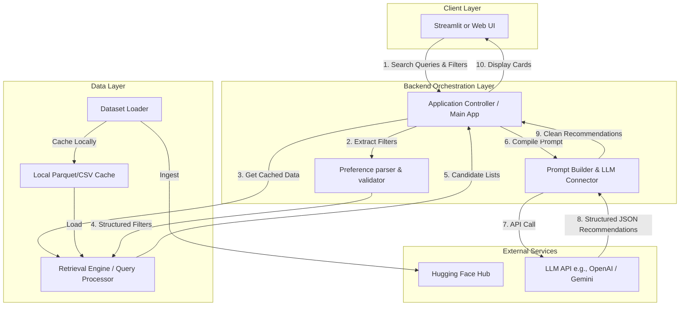

# Detailed System Architecture: AI-Powered Restaurant Recommendation System

This document details the software architecture, module design, data flow, schemas, and implementation choices for the AI-Powered Restaurant Recommendation System. It serves as a blueprint for development.

---

## 🗺️ High-Level System Architecture

The application is structured into a multi-tiered architecture that separates the user interface, backend orchestration, data processing, and external LLM services.



---

## 📦 Detailed Component Description

### 1. Data Ingestion & Storage Module (`data_loader.py`)
Responsible for bootstrapping the application's reference data from the Hugging Face hub.
* **Hugging Face Hub Integration**: Downloads the dataset `ManikaSaini/zomato-restaurant-recommendation` using the `datasets` or `pandas` library.
* **Deduplication & Cleaning**:
  * Drops records missing crucial fields (`Name`, `Cuisines`, `Rating`, `Cost`).
  * Trims whitespace and normalizes text casing.
  * Standardizes rating scale and formats average cost as a flat floating-point value.
* **Local Caching**: Persists the processed dataset locally as a compressed Parquet or CSV file (`data/zomato_cleaned.parquet`) to eliminate network overhead during subsequent runs.

### 2. Retrieval & Pre-Filtering Module (`retriever.py`)
An in-memory query engine (using Pandas) that filters thousands of restaurants down to a relevant subset, preventing context window overflow and excessive token costs.
* **Location Filter**: Case-insensitive substring matching on cities/neighborhoods.
* **Cuisine Filter**: Matches one or more cuisines in a comma-separated column.
* **Budget Classifier**: Translates high-level budget tiers into raw numeric ranges:
  * **Low**: `< 400` INR (or local currency equivalent for two)
  * **Medium**: `400 - 1000` INR
  * **High**: `> 1000` INR
* **Rating Filter**: Filters out restaurants below the user's minimum rating threshold.
* **Truncation/Ranking**: If too many candidates match, it sorts them by `Rating` and `Votes` and takes the top **15–20 candidates** to forward to the LLM.

### 3. Prompt Engineering & LLM Integration Module (`llm_connector.py`)
Constructs the reasoning context and coordinates communication with the LLM API.
* **Prompt Construction**:
  * Inject system instructions outlining the persona (expert local foodie/critic).
  * Inject the user's qualitative goals (e.g., "candlelight dinner", "fast-casual").
  * Inject the structured candidate list as a compact XML, Markdown, or JSON table.
* **LLM Request Orchestration**:
  * Connects to the LLM using official SDKs (e.g., Google Gen AI SDK for Gemini or OpenAI SDK).
  * Configures parameters: `temperature=0.3` (lowered to enforce factual accuracy and reduce formatting hallucinations).
* **Output Validation**:
  * Enforces structured JSON output (via JSON mode or system guidelines).
  * Parses and validates the response, mapping it back to internal domain models.

### 4. Presentation & UI Tier (`app.py`)
Provides an elegant, responsive interface (Streamlit or a standard web framework) where users can input preferences and see results.
* **Control Panel**: Sliders, dropdowns, and free-form text input fields.
* **Results Pane**: Clean grid of cards. Includes responsive loading skeletons while waiting for the LLM response.

---

## 🔄 Dynamic Data Flow Sequence

```mermaid
sequenceDiagram
    autonumber
    actor User
    participant UI as User Interface
    participant App as Backend Controller
    participant RE as Retrieval Engine
    participant LLM as LLM Orchestrator
    
    User->>UI: Submit search (e.g., Delhi, Medium Budget, Italian, "quiet garden")
    UI->>App: Forward search parameters
    App->>RE: Query candidates (Delhi, Budget 400-1000, Cuisines: Italian)
    RE-->>App: Return top 15 matching restaurants (sorted by rating)
    App->>LLM: Compile prompt with 15 candidates + qualitative query ("quiet garden")
    LLM->>LLM: Analyze candidates vs. qualitative query; select & rank top 3-5
    LLM-->>App: Return JSON array (ID, Name, Rank, Custom Explanation)
    App->>UI: Render recommendation cards with custom explanations
    UI->>User: Display results on screen
```

---

## 📑 Data Models & Schemas

### 1. User Preferences Schema
Captured from the interface layer:
```json
{
  "location": "New Delhi",
  "cuisine": ["Italian", "Continental"],
  "budget_tier": "Medium",
  "min_rating": 4.0,
  "additional_notes": "A romantic spot with outdoor seating, preferably away from heavy traffic."
}
```

### 2. Candidate Context Schema (Fed into LLM Prompt)
Represented as a condensed list to optimize token consumption:
```json
[
  {
    "id": 1042,
    "name": "The Olive Bistro",
    "cuisine": "Italian, Continental, Desserts",
    "cost_for_two": 900,
    "rating": 4.3,
    "votes": 512,
    "locality": "Chanakyapuri, New Delhi"
  }
]
```

### 3. Recommendation Response Schema (Returned by LLM)
Strictly enforced using prompt constraints:
```json
{
  "recommendations": [
    {
      "rank": 1,
      "restaurant_id": 1042,
      "name": "The Olive Bistro",
      "suitability_score": 95,
      "reasoning": "Directly matches your request for a romantic spot in Chanakyapuri. It features a lush, quiet garden courtyard and is highly rated (4.3/5) for authentic wood-fired Italian pizzas, perfectly fitting your medium budget constraint of 900 INR."
    }
  ],
  "summary": "Found 3 excellent romantic Italian choices in New Delhi matching your medium budget. The Olive Bistro is your best option for garden dining."
}
```

---

## 🧠 LLM Prompt Blueprint

Below is the conceptual prompt template used by the `llm_connector.py` module:

```markdown
System Prompt:
You are an expert culinary guide and local restaurant critic. Your task is to recommend the best dining options from a provided candidate list based on the user's specific preferences.

User Preferences:
- Location: {user_location}
- Budget Level: {user_budget_tier} (Target cost range: {budget_range})
- Cuisines preferred: {user_cuisines}
- Minimum rating: {min_rating}
- Qualitative description: "{additional_notes}"

Candidate Restaurants Data (Pre-filtered):
```json
{candidates_json}
```

Instructions:
1. Filter the candidate list and select the top 3-5 restaurants that best align with the qualitative description and hard constraints.
2. Provide a numerical `rank` and a detailed, qualitative `reasoning` for each choice. The reasoning must reference specific features of the restaurant (locality, cuisines, budget alignment) and tie them directly to the user's qualitative description.
3. Be highly objective and factually accurate based ONLY on the provided candidate data. Do not invent details.
4. Output your response strictly in the following JSON format:
{response_schema_format}
```

---

## 🛠️ Technology Stack & Dependencies

| Module | Technology / Library | Rationale |
| :--- | :--- | :--- |
| **User Interface** | Python Streamlit / HTML | Lightweight framework for rapid interface prototyping and fluid components. |
| **Data Manipulation** | `pandas` & `pyarrow` | Robust library for in-memory filtering, data transformations, and high-performance Parquet storage. |
| **Dataset Sourcing** | Hugging Face `datasets` | Seamless API access for loading dataset without manual file downloads. |
| **LLM Model** | Gemini 2.5 Flash / OpenAI GPT-4o-mini | High reasoning quality with low latency and highly affordable input token costs. |
| **LLM Orchestration** | `google-generativeai` or `openai` SDK | Direct, lightweight integration without the heavy overhead of large frameworks (like LangChain) where not needed. |

---

## 📈 Error Handling & Edge Cases

> [!WARNING]
> **Scenario 1: Zero Matches in Pre-filtering**
> * *Mitigation*: The `retriever.py` module will relax constraints progressively. First, it will broaden the rating threshold (e.g., 4.0 down to 3.5), and if still zero, relax the budget range, communicating this relaxation transparently to the user in the UI.

> [!CAUTION]
> **Scenario 2: LLM Output Formatting Hallucinations**
> * *Mitigation*: If the JSON parser fails to interpret the LLM response due to malformed characters, the orchestrator runs a secondary lightweight validation block or triggers a retry with a clear parsing guidance instruction.
