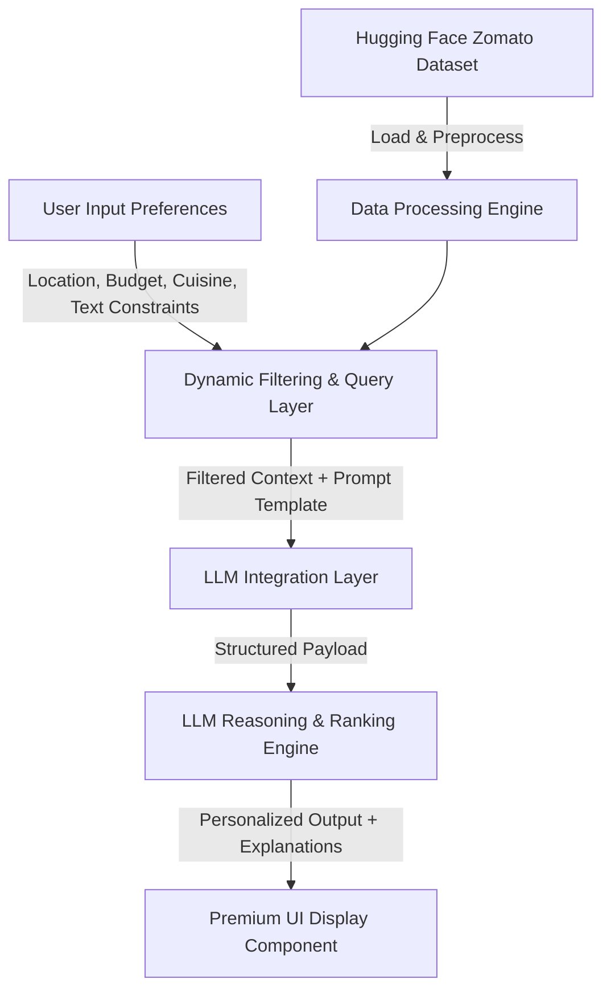

# Project Context: AI-Powered Restaurant Recommendation System (Zomato Use Case)

## 📌 Executive Summary
The **AI-Powered Restaurant Recommendation System** is a personalized food discovery service inspired by Zomato. Traditional recommendation engines rely heavily on static filters (e.g., clicking checkboxes for cuisine or location) or collaborative filtering, which often fail to capture nuanced user preferences or explain *why* a particular restaurant is recommended. 

This project aims to solve this limitation by **combining structured, real-world restaurant data with the cognitive reasoning capabilities of a Large Language Model (LLM)**. Users can provide search queries and rich, free-form preferences, which the system marries with curated Zomato restaurant data to deliver hyper-personalized, human-like recommendations complete with qualitative reasoning.

---

## 🎯 Core Objectives
1. **Intelligent Preference Capture**: Gather multi-dimensional user preferences (e.g., location, budget, cuisine, minimum rating, and contextual inputs like "kid-friendly" or "quiet workspace").
2. **Robust Data Ingestion**: Load, clean, and pre-process a comprehensive real-world dataset of restaurants.
3. **Structured & Semantic Integration**: Build a bridging layer that filters structured data dynamically and constructs high-fidelity, context-rich prompts for the LLM.
4. **AI-Powered Reasoning & Ranking**: Leverage an LLM to rank the matching options, synthesize choices, and explain why each recommendation fits the user's specific mood or constraints.
5. **Premium Output Delivery**: Present structured, visually stunning, and highly legible recommendation cards showcasing names, ratings, costs, and AI-generated rationales.

---

## 📊 Dataset Specifications
The system utilizes the **Zomato Restaurant Recommendation dataset** hosted on Hugging Face:
* **Dataset URL**: [ManikaSaini/zomato-restaurant-recommendation](https://huggingface.co/datasets/ManikaSaini/zomato-restaurant-recommendation)
* **Target Features**:
  * **Restaurant Name**: Identity of the outlet.
  * **Location/Address**: Geographic coordinates and locality (e.g., Delhi, Bangalore).
  * **Cuisines**: Types of food offered (e.g., North Indian, Italian, Chinese).
  * **Cost (Average Cost for Two)**: Budget indicator.
  * **Rating**: Aggregate user review rating and votes.
  * **Additional Amenities/Attributes**: Online delivery status, table booking availability, specific features.

---

## ⚙️ System Workflow & Architecture

### 1. Data Ingestion & Preprocessing
* Load the Zomato dataset directly or cache it locally.
* Parse and clean the dataset: handle missing values, normalize cuisines, convert costs to numeric formats, and standardize rating categories.
* Index features to facilitate fast and accurate database queries.

### 2. User Input Capture
* Captures both explicit structured preferences:
  * **Location** (e.g., Bangalore, New Delhi)
  * **Cuisine** (e.g., Italian, Mughlai, Continental)
  * **Budget Tier** (Low, Medium, High)
  * **Minimum Rating threshold** (e.g., 4.0+)
* Captures open-ended/qualitative preferences:
  * "Great place for a date night with candlelight seating"
  * "Quick bites near the office with outdoor seating"
  * "Family friendly with wheelchair accessibility"

### 3. Integration & Prompt Engineering
* Query the dataset based on hard filters (Location, Cuisine, Budget, Rating).
* Format the matched candidate set into a highly readable structured format (JSON or Markdown tables) to fit into the LLM's context window.
* Feed the candidate set and the user's qualitative preferences into a meticulously engineered prompt template that instructs the LLM to behave as a professional food connoisseur.

### 4. Recommendation & Reasoning Engine (LLM)
* **Constraint Validation**: Ensure selected candidates match all soft and hard criteria.
* **Intelligent Ranking**: Rank the top options based on aggregate scores, review volume, and specific contextual alignment with user preferences.
* **Reasoning Generation**: For each recommended restaurant, output a tailored description explaining exactly why it matches the user's query (e.g., *"Recommended because you requested a quiet outdoor space, and this place is famous for its serene garden seating away from the main road"*).

### 5. Premium Presentation UI
* Display results in clean, card-based components.
* Highlight key quick-glance data:
  * **Restaurant Name**
  * **Cuisine Badges**
  * **Ratings & Reviews Count**
  * **Average Cost for Two**
  * **AI-Generated Rationale** (styled elegantly to stand out from the raw data).

---

## 🛡️ Key Technical Challenges & Design Decisions

> [!IMPORTANT]
> **Data Volume vs. Prompt Windows**: The Zomato dataset contains thousands of rows. We cannot feed all of them into the LLM. We must perform smart pre-filtering in memory or using databases first, passing only the most relevant candidates (e.g., top 15-20) to the LLM for detailed analysis.

> [!TIP]
> **Budget & Rating Mapping**: Budgets in Zomato are expressed as numerical "Cost for Two" (e.g., `1200`). We must map user inputs like "Medium Budget" to realistic ranges (e.g., `500 - 1500`) based on regional statistics to ensure accurate matching.

* **LLM Output Formatting**: Guaranteeing that the LLM consistently returns structured data (e.g., valid JSON or consistent markdown) without hallucinations or broken formats. This will be enforced using strict schema validation or system prompts.
* **Cold Starts & Fallbacks**: Defining clear fallback strategies if no restaurants match a highly restrictive search query (e.g., automatically relaxing rating constraints or expanding the geographic radius and warning the user).

---

## 🚀 Future Roadmap & Extensions
* **Semantic Search / Vector Embeddings**: Embed restaurant descriptions and reviews using an embedding model (e.g., OpenAI, Cohere, or Hugging Face) and run cosine similarity search for even more human-like matching.
* **Interactive Conversational UI**: A multi-turn chat assistant where users can refine recommendations (e.g., *"Now show me options from this list that are closer to the metro station"*).
* **Live Geolocation Integration**: Auto-detect user location to immediately suggest nearby trending eateries.
