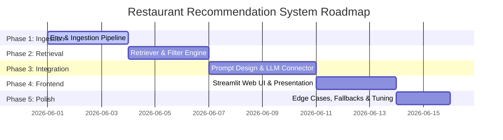

# Phase-Wise Project Implementation Plan

This document outlines a structured, 5-phase roadmap for building the **AI-Powered Restaurant Recommendation System**. Each phase focuses on a core component of the system architecture, detailing the tasks, deliverables, and validation steps.

---

## 🗺️ Roadmap Overview



---

## 🛠️ Phase 1: Environment Setup & Data Ingestion (Foundation)
**Objective**: Build a clean workspace and ensure a reliable, cached local copy of the preprocessed Zomato dataset.

### 📋 Key Tasks:
1. **Workspace Setup**:
   * Initialize a Python virtual environment (`.venv`).
   * Create the directory structure:
     ```text
     ├── data/                 # Cached and raw data files
     ├── docs/                 # Project documentation
     ├── src/                  # Application source code
     │   ├── __init__.py
     │   ├── data_loader.py    # Data Ingestion
     │   ├── retriever.py      # Pre-Filtering
     │   ├── llm_connector.py  # LLM API orchestration
     │   └── app.py            # Streamlit Frontend UI
     └── requirements.txt      # Project dependencies
     ```
2. **Dependency Configuration**:
   * Create `requirements.txt` with required packages:
     `pandas`, `pyarrow`, `datasets` (Hugging Face), `google-generativeai`, `openai`, `streamlit`, `python-dotenv`.
3. **Data Sourcing Script (`data_loader.py`)**:
   * Build a script that connects to Hugging Face and downloads `ManikaSaini/zomato-restaurant-recommendation`.
   * Implement robust network fail-safe checks and progress bars.
4. **Data Cleaning & Standardization**:
   * Parse numerical columns (`Rating`, `Votes`, `Cost`).
   * Normalize text formats (trim strings, standardize casing for location names).
   * Fill missing values or drop records with missing critical fields.
   * Write the cleaned dataset to `data/zomato_cleaned.parquet`.

### 🔬 Verification & Deliverables:
* **Deliverable**: `src/data_loader.py` and `data/zomato_cleaned.parquet`.
* **Test**: Run `python src/data_loader.py` and verify that a parquet file is generated and contains `Name`, `Location`, `Cuisine`, `Rating`, and `Cost` fields with zero null values.

---

## ⚙️ Phase 2: In-Memory Retrieval Engine (Core Filtering)
**Objective**: Construct the filtering logic that reduces the dataset size from thousands to the top 10–15 candidate restaurants.

### 📋 Key Tasks:
1. **Retriever Class Formulation (`src/retriever.py`)**:
   * Build a `RestaurantRetriever` class that loads the parquet file into a Pandas DataFrame upon initialization.
2. **Criteria Matching Logic**:
   * **Location Matching**: Substring and case-insensitive check (e.g. searching "Connaught" matches "Connaught Place, New Delhi").
   * **Cuisine Matching**: Tokenize query cuisine inputs and match with the comma-separated cuisine fields in Zomato.
   * **Rating Match**: Filter where `rating >= min_rating`.
   * **Budget Classifier**: Map "Low", "Medium", "High" to local currency values:
     * Low: `< 400`
     * Medium: `400` to `1000`
     * High: `> 1000`
3. **Sorting & Context Selection**:
   * Implement a sorting mechanism using a combined score: `Rating` weighted by total `Votes` (reviews count) to prioritize trusted restaurants.
   * Restrict maximum candidate output to **15 restaurants** to avoid bloating the LLM's context window.

### 🔬 Verification & Deliverables:
* **Deliverable**: `src/retriever.py` module.
* **Test**: Write a simple unit script that queries the retriever with `Location='Delhi'`, `Cuisine=['North Indian']`, and `Budget='Medium'`. Verify that the output list contains a maximum of 15 records sorted correctly.

---

## 🧠 Phase 3: Prompt Engineering & LLM Integration (AI Engine)
**Objective**: Build the bridge between the retrieval engine and the LLM API, ensuring high-quality, structured output.

### 📋 Key Tasks:
1. **API Keys & Config Management**:
   * Set up system environment variable handling via `.env`.
   * Initialize the LLM SDK (Gemini or OpenAI).
2. **Strict JSON Schema Blueprint**:
   * Set up JSON response validation schemas.
3. **Prompt Composition (`src/llm_connector.py`)**:
   * Design a targeted prompt that incorporates:
     * System persona instructions.
     * Structured candidate records.
     * Qualitative requests (e.g., "outdoor garden seating", "dog-friendly").
     * Strict JSON formatting rules.
4. **Reasoning Integration**:
   * Instruct the LLM to output custom recommendations, providing specific evidence from features why it suits the query.
5. **Robust Parsing Fallback**:
   * Add validation blocks to catch malformed JSON and run immediate fallbacks (re-prompting or error messages).

### 🔬 Verification & Deliverables:
* **Deliverable**: `src/llm_connector.py`.
* **Test**: Execute a test query feeding dummy candidate data. Ensure that the returned output parses successfully into Python dicts without error.

---

## 🎨 Phase 4: User Interface Development (Presentation Layer)
**Objective**: Create a highly polished, responsive Streamlit dashboard representing the Zomato use case.

### 📋 Key Tasks:
1. **App Interface Foundations (`src/app.py`)**:
   * Setup layout: Wide layout, custom page title, sidebar for inputs, and main panel for recommendation output.
   * Inject premium typography and styling via subtle CSS adjustments.
2. **Search Input Widget Panel**:
   * Location selector (autocomplete / select box).
   * Cuisine multiselect options (dynamically loaded from unique cuisines in the dataset).
   * Budget slider/radio button selector ("Low", "Medium", "High").
   * Qualitative keyword entry text field ("What are you looking for? e.g., rooftop, quick bite").
3. **Loading Transitions**:
   * Display a clean spinning skeleton loader while LLM is generating results to maintain user engagement.
4. **Responsive Recommendation Cards**:
   * Display top 3-5 recommendations using styled container blocks.
   * Feature rating badges (colored green/orange based on value) and average cost indicators.
   * Devote prominent card space to show the custom **AI-Generated Rationale**.

### 🔬 Verification & Deliverables:
* **Deliverable**: `src/app.py`.
* **Test**: Run `streamlit run src/app.py` in terminal. Verify that the UI opens in browser, inputs update state correctly, and matching restaurants display beautifully.

---

## 🛡️ Phase 5: Polish, Error Handling & Advanced Refinements
**Objective**: Optimize system behavior, handle edge cases gracefully, and finalize deployment.

### 📋 Key Tasks:
1. **Zero Match Fallback Flow**:
   * If the hard filter (e.g., location/cuisine combinations) returns 0 records, implement an automatic relaxation engine:
     1. Relax budget constraints first.
     2. Expand rating cutoff (e.g., reduce from 4.0 to 3.5).
     3. Suggest nearby localities.
     4. Notify user in the UI: *"We relaxed your rating constraint slightly to find matching locations!"*
2. **Prompt Tuning & Context Window Tuning**:
   * Optimize JSON keys to minimize token usage.
   * Lower the LLM model temperature to prevent hallucinations or formatting issues.
3. **System Testing & Documentation**:
   * Perform comprehensive multi-city and extreme preference verification (e.g., ultra-specific keywords).
   * Complete walkthrough guides and documentation.

### 🔬 Verification & Deliverables:
* **Deliverable**: Full working codebase with seamless fallback mechanisms.
* **Test**: Test a search query that has zero matches (e.g., rating `4.9` with `Low` budget). Verify that the system handles this gracefully without crashing and explains the fallback relaxation.
